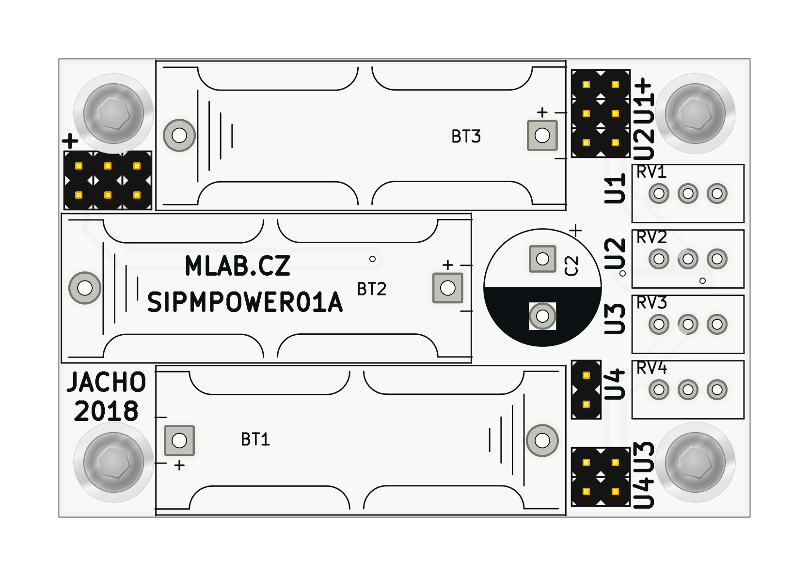
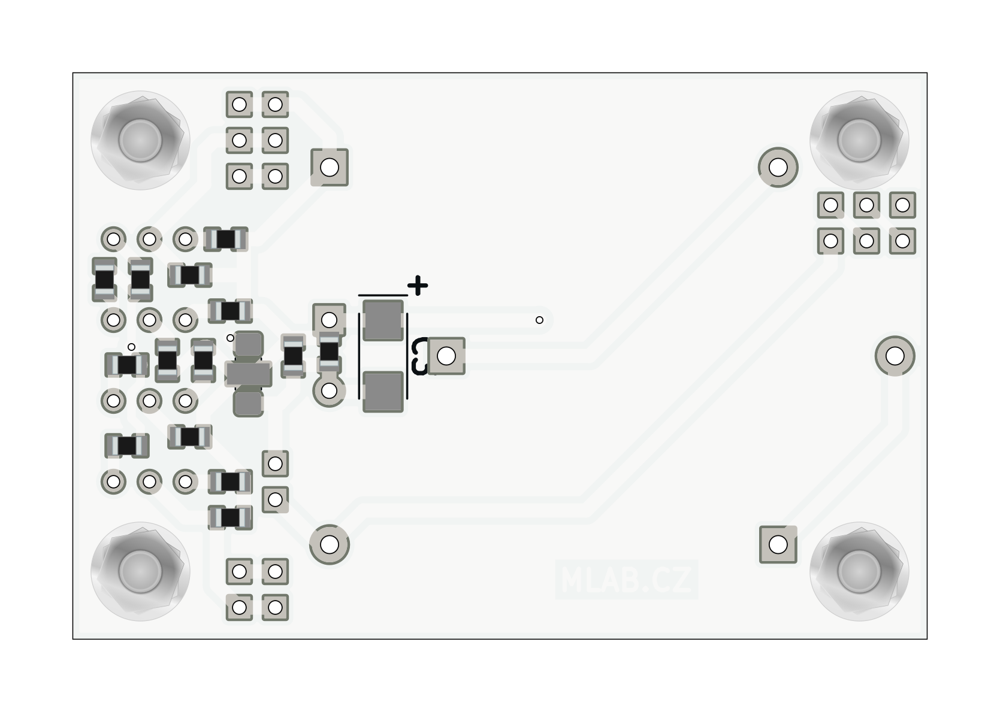

# SIPMPOWER01A - power module for SiPM

Batterry power module to obsolete [SIPM01A](https://github.com/mlab-modules/SIPM01) Silicon photomultiplier module.
Now is superseded by using the [STEPUPDC02](https://github.com/mlab-modules/STEPUPDC02) voltage converter.

